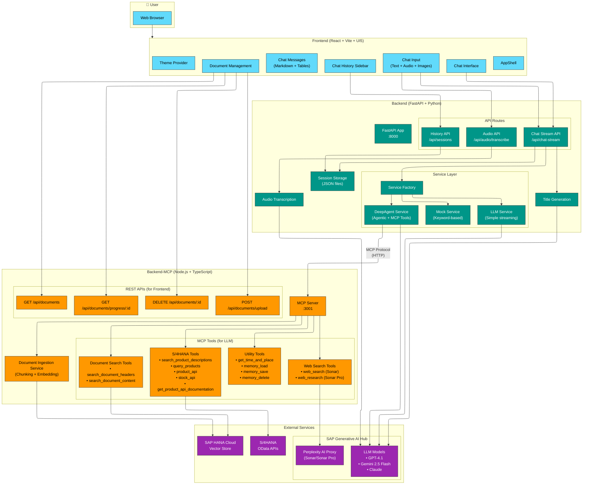

# Super Agent Architecture Diagram

## Legend

| Color | Component Type |
|-------|----------------|
| 🔵 Cyan | Frontend (React/UI5) |
| 🟢 Teal | Backend (FastAPI/Python) |
| 🟠 Orange | Backend-MCP (Node.js/MCP Server) |
| 🟣 Purple | External Services |

## Key Data Flows

1. **Chat Flow**: User → Frontend → Backend API → Service Factory → LLM/DeepAgent → Response
2. **Document Upload**: Frontend → Backend-MCP REST API → Chunking → Embedding → HANA Vector Store
3. **Document RAG**: DeepAgent → MCP Tool → HANA Vector Search → Context → LLM Response
4. **Web Research**: DeepAgent → MCP Tool → SAP AI Hub → Perplexity API → Research Results
5. **Audio Transcription**: Frontend → Backend API → SAP AI Hub → Gemini → Text
